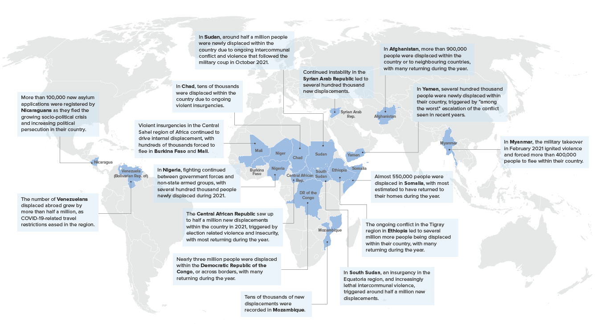

```{r setup, include=FALSE}
options(htmltools.dir.version = FALSE)
knitr::opts_chunk$set(
  warning = FALSE,
  message = FALSE,
  echo = FALSE,
  fig.showtext = TRUE,
  dpi = 300,
  fig.retina = 4,
  dev = "ragg_png"
)
# Load packages
library(tidyverse)
library(unhcrdatapackage)
library(unhcrthemes)
library(fontawesome)
library(scales)
library(httr2)
library(jsonlite)
library(readxl)
```

```{r main-data, include=FALSE}
### Population data from Refugee data finder: REF, ASY, VDA | 2012-2021
unhcr <- unhcrdatapackage::end_year_population_totals_long |>
    filter(
        Year >= 2012 & Year <= 2021,
        Population.type == "REF" |
        Population.type == "ASY" |
        Population.type == "VDA"
    )  |>
    group_by(Year, Population.type.label) |>
    summarise(total = sum(Value, na.rm = TRUE)) |>
    rename(year = Year, pop_type = Population.type.label) |> 
    mutate(pop_type = case_when(
      pop_type == "Refugees" ~ "Refugees under UNHCR's mandate",
      pop_type == "Venezuelans Displaced Abroad" ~ "Venezuelans displaced abroad",
      TRUE ~ pop_type)
      )

### UNRWA refugees | 2012 - 2021
# Refugee data finder API URL
rdf_url <- request("https://api.unhcr.org/population/v1")

# Call API for UNRWA data
unrwa_api <-  rdf_url |>
  # Then we add on the path
  req_url_path_append("unrwa") |>
  # Add query parameters
  req_url_query(yearFrom = 2012, yearTo = 2021) |>
  req_perform() |>
  resp_body_json()

# Create unrwa df
unrwa <- bind_rows(unrwa_api$items) |>
    select(year, total) |>
    mutate(pop_type = "Refugees under UNRWA's mandate") |>
    relocate(total, .after = pop_type)

### IDMC stock | 2012 - 2021
# Call API for IDMC data
idmc_api <- rdf_url |>
  # Then we add on the path
  req_url_path_append("idmc") |>
  # Add query parameters
  req_url_query(yearFrom = 2012, yearTo = 2021) |>
  req_perform() |>
  resp_body_json()

# Create idmc df
idmc <- bind_rows(idmc_api$items) |>
    select(year, total) |>
    mutate(pop_type = "IDPs") |>
    relocate(total, .after = pop_type)

### Latest estimates 2022
estim <- tribble(
    ~year, ~pop_type, ~total,
    2022, "Latest available estimates", 101088700,
)

### Demographics women and children by pop_type | 2021
# Data from RDF all pop but IDP and UNRWA
dem_unhcr <- unhcrdatapackage::demographics |> 
  filter(Year == 2021) |> 
  mutate(ChildrenTotal = rowSums(across(Female04:Female1217), na.rm = TRUE) + rowSums(across(Male04:Male1217), na.rm = TRUE)) |> 
  select(Population.type, Population.type.label, FemaleTotal, ChildrenTotal, Total) |> 
  group_by(Population.type, Population.type.label) |> 
  summarise(f_total = sum(FemaleTotal, na.rm = TRUE),
            c_total = sum(ChildrenTotal, na.rm = TRUE),
            total = sum(Total, na.rm = TRUE),
            f_perc = f_total/total,
            c_perc = c_total/total) |>
  filter(Population.type != "HST",
         Population.type != "IDP") |> 
  select(Population.type.label, f_perc, c_perc) |> 
  rename(pop_type = Population.type.label,
         female_perc = f_perc,
         children_perc = c_perc)

# IDMC and UNRWA demographic data
dem_idmc_unwra <- tribble(
  ~pop_type, ~female_perc, ~children_perc,
  "Palestine refugees under UNRWA's", 0.49, 0.31,
  "Internally displaced people", 0.5, 0.43,
)
```

## Forced displacement

.pull-left[
.large[.blue[**89.3 million**]] forcibly displaced worldwide at the end of 2021 – increasing to more than .large[.blue[**100 million**]] by May 2022

- **27.1 million** refugees (+754,400), including 5.8 million Palestinian refugees under UNRWA’s mandate.

- **53.2 million** IDPs<sup class="small">1</sup> (+5.1 million).

- **4.6 million** asylum seekers (+438,400).

- **4.4 million** Venezuelans displaced abroad (VDA) (+544,300).
]

.pull-right[
```{r, out.width="100%", fig.height=5.5}
# Data
force_displ <- rbind(unhcr, idmc, unrwa, estim) |>
    mutate(pop_type = factor(pop_type,
                      levels = c("Latest available estimates", 
                      "Venezuelans displaced abroad", "Asylum-seekers", 
                      "Refugees under UNRWA's mandate",
                      "Refugees under UNHCR's mandate", "IDPs")))

# Plot
ggplot(data = force_displ,
       aes(x = year, y = total,
           fill = pop_type, group = pop_type)) +
  geom_col() +
  scale_x_continuous(breaks = scales::pretty_breaks(n = 10)) +
  scale_y_continuous(labels = scales::label_number(scale_cut = cut_short_scale()),
                     expand = expansion(c(0, 0.1))) +
  scale_fill_unhcr_d(guide=guide_legend(reverse = TRUE), direction = -1,
                     palette = "pal_unhcr_poc",
                     nmax = 9, order = c(4, 1:3, 9, 8)) +
  labs(title = "People forced to flee worldwide | 2012-2022",
    caption = "Source: UNHCR Refugee Data Finder\n© UNHCR, The UN Refugee Agency") +
  theme_unhcr(grid = "Y",
              axis_title = FALSE)
```
]

.footnote[
<sup class="small">1</sup>Internal Displacement Monitoring Centre
]

---

## Forced displacement

.center[
```{r, out.width="80%"}

```
]

???
Forced displacement could become one of **defining the legacies of the 21st century.

Conflicts around the world are substantially increasing in both numbers and magnitude.

A total of 23 countries with a population of **850 million people**, faced high- or medium-intensity conflicts in 2021.

2022 has already seen **millions displaced by the war** in Ukraine, while the humanitarian crises in Myanmar and Burkina Faso and elsewhere continued to deteriorate.

---

## Demographics

Demographic **coverage continues to improve** for forcibly displaced people and for other population groups.

.pull-left[
```{r}
# Data
dem_table <- rbind(dem_unhcr, dem_idmc_unwra) |> 
  mutate(pop_type = factor(pop_type,
                           levels = c("Refugees", "Palestine refugees under UNRWA's",
                                      "Venezuelans Displaced Abroad", "Asylum-seekers",
                                      "Internally displaced people", "Refugee returns",
                                      "IDP returns", "Stateless Persons", "Others of Concern to UNHCR"))) |> 
  arrange(pop_type) |> 
  mutate(female_perc = paste0(round(female_perc*100, 0), "%"),
         children_perc = paste0(round(children_perc*100, 0), "%")) 
  
# Table
dem_table |> 
  knitr::kable(format = "html",
               col.names = c("Population group", "Female", "Children"),
               caption = "Percentage of women and children by population group | 2021<br>Note: IDPs figures from Internal Displacement Monitoring Centre",
               align = "lrr",
               table.attr = "class=\"table  table-blue table-noborder small\"")

```
]

.pull-right[
```{r, out.width="100%", fig.height=4}
# Plot data
dem_plot <- tribble(
  ~age, ~male, ~female,
  "60+", 0.03, 0.03,
  "18-59", 0.27, 0.26,
  "0-17",  0.21, 0.20,
)

# Plot
ggplot(dem_plot) +
  geom_col(aes(-male,
    age,
    fill = "Male"
  ),
  width = 0.5
  ) +
  geom_col(aes(female,
    age,
    fill = "Female"
  ),
  width = 0.5
  ) +
  geom_text(aes(-male/2,
    age,
    label = percent(abs(male))
  ),
  size = 8 / .pt,
  color = "white",
  fontface = "bold"
  ) +
  geom_text(aes(female/2,
    age,
    label = percent(abs(female))
  ),
  size = 8 / .pt,
  color = "white",
  fontface = "bold"
  ) +
  labs(
    title = "Demographics of people who have been forcibly displaced | 2021",
    subtitle = "Children account for 30 percent of the world's population, but 41 percent of all forcibly displaced people.",
    caption = "Note: figures do not add up to 100 per cent due to rounding\nSource: 2021 Global Trends\n© UNHCR, The UN Refugee Agency"
  ) +
  scale_x_continuous(expand = expansion(c(0.1, 0.1))) +
  scale_fill_manual(values = setNames(
    unhcr_pal(n = 3, "pal_unhcr")[c(2, 1)],
    c("Male", "Female")
  )) +
  annotate("text", x = -.14, y = 3.3, label = "Male",
           size = 9 / .pt, color = unhcr_pal(n = 1, "pal_blue"),
           fontface = "bold") +
  annotate("text", x = .14, y = 3.3, label = "Female",
           size = 9 / .pt, color = unhcr_pal(n = 1, "pal_navy"),
           fontface = "bold") +
  theme_unhcr(
    grid = FALSE,
    axis = FALSE,
    axis_title = FALSE,
    axis_text = "y",
    legend = FALSE
  )
```
]

---

## Solutions

.pull-left[
The availability of durable solutions is **not keeping track** with forced displacement.

- The global forced displaced population has more than doubled since 2012, while the available solutions have not kept pace.

- Durable solutions have therefore become an option for fewer and fewer refugees and internally displaced people.

- Greater international solidarity and responsibility-sharing are urgently required.
]

.pull-right[

]

---
class: middle, center, inverse

# Refugees and<br>Venezuelans displaced abroad

## `r fontawesome::fa_i("person-walking-dashed-line-arrow-right")`


