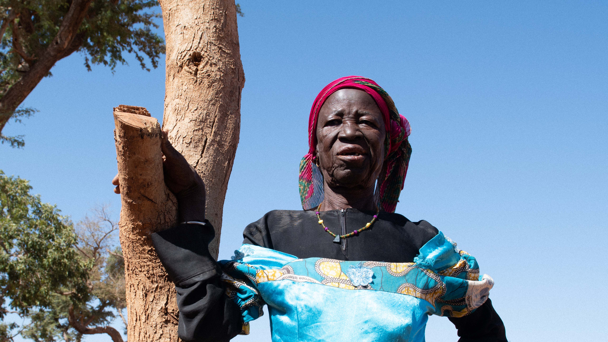

---
# Front cover title and subtitle. Also use in the running header thoughout the document
title: "Super Nice"
subtitle: "Title"
# Abstract create an introduction box on the cover. Should be concise.
#If you want want a full page image just remove abstract-title and abstract from the YAML
abstract-title: Incredible sub-title
abstract: "Tur, sequis sunt abor rempos molupiet lab ipsa natque con niminve llesequos derro restes serionet autasperit ut estrum, ut quia excero et vit voloreic torum quae erias earchil explique pe officabo"
# Date is used in the running footer
date: "8 November 2021"
# Author are the persons creating the doc. They won't appear in the doc but will be part of the DOM.
# For the contact on the back cover, please refer to the bottom of the Rmd and ammend accordingly.
author:
  - name: Cedric Vidonne
    affiliation: IMO
    email: <vidonne@unhcr.org>

output: 
  unhcRstyle::unhcr_templ_paged: 
    # Change to false to remove table of content
    front_img: img/cover.jpg
    toc: true
    # Change to true to add number in front of chapters
    number_sections: false
    # Change to true for a self-contained document, but it'll be a litte slower for Pandoc to render
    self_contained: true
# Set  toc title, default none
toc-title: Contents
# Change to false to remove list of tables
lot: false
# Set lot title, default: "List of Tables"
lot-title: "Tables"
# Change to false to remove list of figures
lof: false
# Set lof title, default: "List of Figures"
lof-title: "Figures"
# If you include any <abbr> a list of abbreviations will be built.
# Set lof title, default: "List of Abbreviations"
loa-title: "Acronyms"
# Include footnotes direclty in the related page
paged-footnotes: true
# Turn links to footnote when printing the PDF on/off
links-to-footnotes: true
# uncomment this line to produce HTML and PDF in RStudio:
#knit: pagedown::chrome_print
---

```{r setup, include=FALSE}
knitr::opts_chunk$set(echo = TRUE)
```

```{r packages, include=FALSE, message=FALSE, warning=FALSE}
# Load required packages for charts with UNHCR style 
library(unhcRstyle)
library(ggplot2)
library(tidyverse)
library(unhcrdatapackage)
library(scales)
library(ragg)
library(unhcrthemes)
update_geom_font_defaults()
```


# Title 1

::: {.lead .unhcr-grey}
This R Markdown document includes all the necessary features and styles to create an UNHCR branded report.
:::

Lorem ipsum dolor sit amet, consectetur adipiscing elit. Cras posuere vel leo et maximus. Nulla eget est libero. Aliquam eu tellus convallis, imperdiet sapien non, tristique dolor. Aenean porttitor augue eu dapibus luctus. Mauris iaculis mauris id ipsum accumsan, et aliquet tortor aliquam. Nullam tortor orci, dignissim vitae commodo in, facilisis vel felis. Donec imperdiet, urna et maximus finibus, quam erat aliquam lorem, et accumsan quam dui vel ante. Aliquam vehicula mollis arcu vel fermentum. Aenean pulvinar egestas pulvinar. Class aptent taciti sociosqu ad litora torquent per conubia nostra, per inceptos himenaeos. Suspendisse leo augue, tempor vitae ullamcorper a, malesuada vel lectus. Nam sed ipsum sem. Vestibulum vehicula dignissim semper. Fusce blandit orci vitae tellus finibus mattis. In aliquam vehicula luctus.


*Image caption text. &copy; UNHCR Photographer name*

Duis nulla augue, aliquam ut risus nec, consectetur cursus velit. Vivamus neque diam, euismod sed quam nec, sodales facilisis turpis. Nullam a nisi eu nisl fringilla sagittis vitae id augue. Phasellus eget risus in odio porta dictum sit amet at augue. Integer accumsan lectus urna, vitae blandit lorem pulvinar fringilla. Donec arcu est, eleifend non rhoncus vel, eleifend in lacus. Sed sit amet tellus dapibus, mollis purus at, congue libero. Curabitur ac purus nec libero dapibus feugiat. Interdum et malesuada fames ac ante <abbr title="The United Nations High Commissioner for Refugees">UNHCR</abbr> ipsum primis in faucibus. Donec porttitor nulla lorem. Nunc faucibus nibh in vestibulum dignissim. In hac habitasse platea dictumst. Nunc eget mi sed libero porttitor tempor ut id odio. In gravida ante sed erat tristique hendrerit.

## Lorem

Pellentesque purus risus, dignissim a sapien id, mollis maximus metus. Pellentesque volutpat pulvinar scelerisque. Pellentesque hendrerit dolor id molestie fermentum. Nunc elementum leo arcu, tristique lacinia odio fermentum non. In feugiat pretium purus, id porta erat laoreet ut. Praesent rhoncus lectus eros, nec egestas enim tempor sit amet. Morbi venenatis diam et vehicula dictum. Etiam ultrices viverra ante hendrerit porta. Duis condimentum, sem vitae lobortis venenatis, ante ligula placerat massa, vel aliquet elit justo pulvinar nunc. Sed sagittis pretium nulla in lacinia. Vestibulum lobortis cursus neque ac euismod. Ut porttitor, quam sed faucibus viverra, nisl magna hendrerit justo, in mollis nunc metus vitae dui. Nam pellentesque tellus nisl, ac facilisis quam hendrerit ac.

> It is further proof that refugee movements and the broader issue of migration of populations ... is a global challenge that cannot be confined to a few countries.
>
> Filippo Grandi

Ut arcu arcu, ultrices id urna et, ultrices feugiat orci. Integer dignissim mattis lorem a dictum. Curabitur condimentum dolor orci, sed aliquam quam tincidunt quis. Duis pretium feugiat arcu vel volutpat. Etiam nec ante congue, sollicitudin risus et, finibus elit. Donec fringilla, neque ut volutpat dignissim, odio justo tincidunt eros, at semper leo sem quis lectus. In porttitor orci sed neque tristique, eu interdum ex sollicitudin. Nam in elementum velit. Etiam a malesuada tellus. Nullam varius in tortor ut suscipit. Sed arcu augue, pretium luctus laoreet at, porttitor nec ligula. Nulla facilisi.

Suspendisse rhoncus enim non felis mollis elementum. Duis lobortis dolor tincidunt justo pretium scelerisque. Nulla nisl arcu, laoreet nec pretium ac, mollis vitae tortor. Cras maximus suscipit felis. Quisque imperdiet purus ut metus mattis scelerisque. Nulla vitae libero purus. Sed et nisi tincidunt magna pellentesque egestas. Suspendisse fringilla massa nec bibendum eleifend. Donec eget nunc nisl. In hac habitasse platea dictumst. Maecenas vitae tortor nibh. Curabitur quam neque, mattis ac feugiat vitae, auctor congue quam. Nam tortor nisi, porta sit amet porta ut, aliquet vel mauris. In porta purus non semper posuere. Interdum et malesuada fames ac ante ipsum primis in faucibus. Phasellus et metus bibendum, rutrum nisi sed, vestibulum tellus.

## Lorem

Pellentesque purus risus, dignissim a sapien id, mollis maximus metus. Pellentesque volutpat pulvinar scelerisque. Pellentesque hendrerit dolor id molestie fermentum. Nunc elementum leo arcu, tristique lacinia odio fermentum non. In feugiat pretium purus, id porta erat laoreet ut. Praesent rhoncus lectus eros, nec egestas enim tempor sit amet. Morbi venenatis diam et vehicula dictum. Etiam ultrices viverra ante hendrerit porta. Duis condimentum, sem vitae lobortis venenatis, ante ligula placerat massa, vel aliquet elit justo pulvinar nunc. Sed sagittis pretium nulla in lacinia. Vestibulum lobortis cursus neque ac euismod. Ut porttitor, quam sed faucibus viverra, nisl magna hendrerit justo, in mollis nunc metus vitae dui. Nam pellentesque tellus nisl, ac facilisis quam hendrerit ac.

Ut arcu arcu, ultrices id urna et, ultrices feugiat orci. Integer dignissim mattis lorem a dictum. Curabitur condimentum dolor orci, sed aliquam quam tincidunt quis. Duis pretium feugiat arcu vel volutpat. Etiam nec ante congue, sollicitudin risus et, finibus elit. Donec fringilla, neque ut volutpat dignissim, odio justo tincidunt eros, at semper leo sem quis lectus. In porttitor orci sed neque tristique, eu interdum ex sollicitudin. Nam in elementum velit. Etiam a malesuada tellus. Nullam varius in tortor ut suscipit. Sed arcu augue, pretium luctus laoreet at, porttitor nec ligula. Nulla facilisi.

```{r single-bar, echo=FALSE, message=FALSE, warning=FALSE, fig.cap="Total displaced people - UNHCR Refugee Statistics"}
poc_2010_2020 <- end_year_population_totals_long %>% 
  filter(Year >= 2010)
total_displaced_2010_2020 <- poc_2010_2020 %>% 
  group_by(Year) %>% 
  summarise(total_disp = sum(Value))

ggplot(total_displaced_2010_2020, aes(x = Year, y = total_disp)) +
  geom_col(fill = unhcr_pal(1, "pal_blue")) +
  scale_x_continuous(n.breaks = 10) +
  scale_y_continuous(expand = expansion(mult = c(0, 0.15)),
                     labels = scales::label_number_si()) +
  labs(x = NULL, y=NULL,
      title = "Total people displaced | 2010-2020",
      subtitle = "Number of people in millions",
      caption = "Source: UNHCR Data Finder") +
  unhcrthemes::theme_unhcr(grid = "Y")
```

Suspendisse rhoncus enim non felis mollis elementum. Duis lobortis dolor tincidunt justo pretium scelerisque. Nulla nisl arcu, laoreet nec pretium ac, mollis vitae tortor. Cras maximus suscipit felis. Quisque imperdiet purus ut metus mattis scelerisque. Nulla vitae libero purus. Sed et nisi tincidunt magna pellentesque egestas. Suspendisse fringilla massa nec bibendum eleifend. Donec eget nunc nisl. In hac habitasse platea dictumst. Maecenas vitae tortor nibh. Curabitur quam neque, mattis ac feugiat vitae, auctor congue quam. Nam tortor nisi, porta sit amet porta ut, aliquet vel mauris. In porta purus non semper posuere. Interdum et malesuada fames ac ante ipsum primis in faucibus. Phasellus et metus bibendum, rutrum nisi sed, vestibulum tellus.


::: {.back-cover}

::: {.back-header}
<h1 class="back-title"></h1>
<h1 class="back-subtitle"></h1>
:::

::: {.back-footer}
For more information please contact:

::: {.back-contact}
[Cedric Vidonne]{.back-name}

IMO

[vidonne@unhcr.org](mailto:vidonne@unhcr.org)
:::


:::

:::


